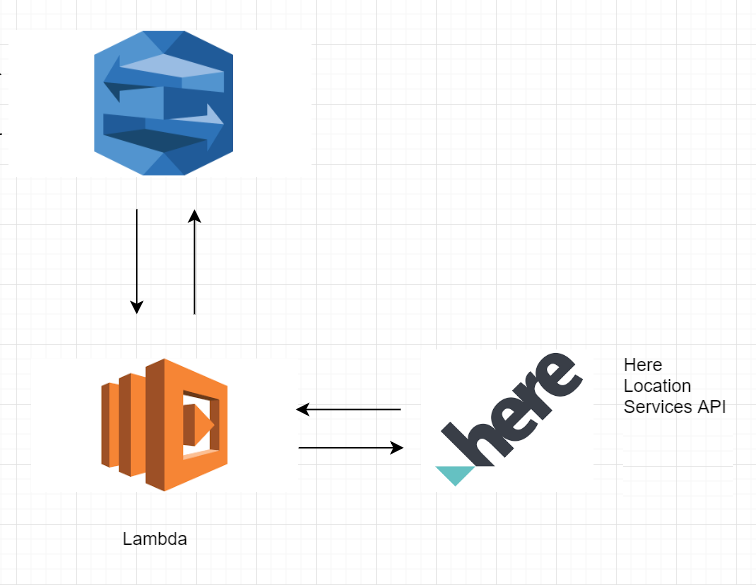
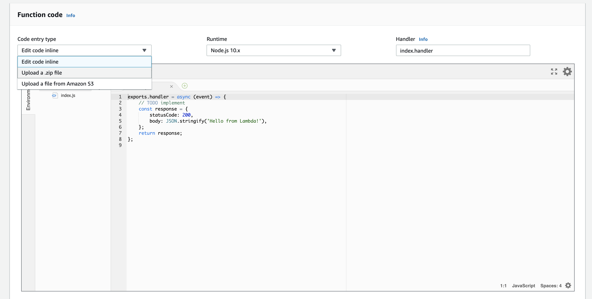
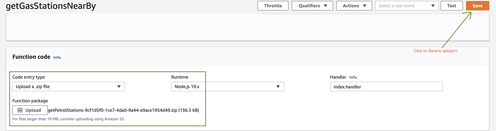
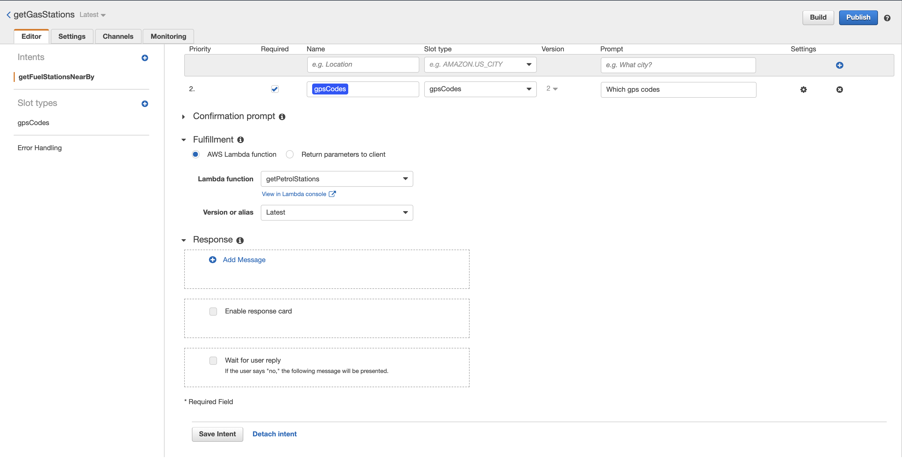
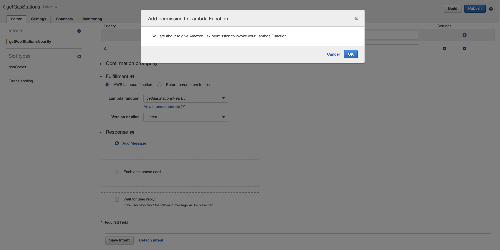
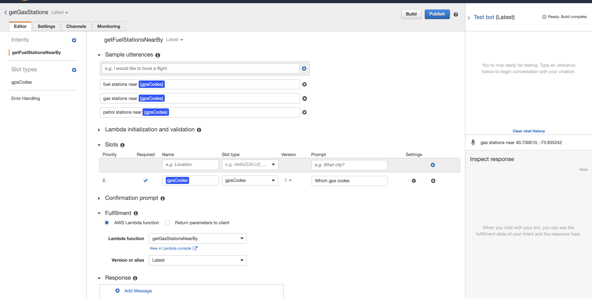

## Building a gas stations chatbot with AWS Lex, Lambda and HERE services:

In this workshop, we will deploy a small chatbot with AWS Lex and HERE services to help people find the gas stations near a specified location. We will explore the combination of AWS services, HERE Location Services and how they can be stitched together to create the beginnings of a powerful and scalable application. To complete this workshop, you will need: A personal AWS Account, basic knowledge of the AWS , an account with HERE (https://developer.here.com),and some basic understanding of node/Javascript.

### Prerequisites:
* HERE Services credentials.
* Knowledge on AWS Lex and Lambda



### Getting HERE credentials from AWS Market place

To get the credential, head over to <a href="https://aws.Amazon.com/marketplace">AWS Marketplace</a>. Select HERE from the vendor drop down and click on _View results_ button.


In the next page you will find the HERE Location Services, go ahead and click on it. Now you will be greeted with HERE Location Services overview page. On the top lefthand side of the page you will find the _Continue to Subscribe_ button click on it to subscribe for HERE Services. 

_PS:You don't need credit card for the subscription_


Once subscribed you will see a succuss message like so:


Now that you have successfully subscribed, click on the _Setup your account_ button. After this you will be asked to sign up for a HERE Developer Account.


Now, complete the form and sign up to get your HERE credentials.

Once logged in you will notice the __generate__ button, go ahead and click on it to generate codes.

Finally, you will get the code as shown below


# Step 1: Deploy Lex bot

Login to your AWS console, search for Amazon Lex from the console and click on it. Now, click on the "create" button to get started and then on the next screen, click "Custom Bot" and fill in the details as shown in the screenshot below.


Once you fill in the all the required details click on *"Create"*
button to navigate to the next screen. 


On the next screen you will see "Create Intent". 

__An Intent is a objective or action the user wants to achieve. Think of an intent as the specific reason a user would want to send a message to your bot.__

Lets create an intent and call it "gasStationNearBy". 


Once you have done that, you will be greeted by another screen with a many input options. Lets focus on the Slots section first.


__You can think of Slots as the Variables of Lex. If someone was ordering a pizza, the Slots to include would be things like {SIZE}, {PIZZA_TYPE} and {DELIVERY_ADDRESS}.__

__There is a lot to discuss about slots and different slot types. Essentailly there are two types of slot available custom slots and builtin slots. For our chatbot we will be creating the custom slot. I encourage you to see more information about slots on the <a href="https://docs.aws.Amazon.com/Lex/latest/dg/howitworks-builtins-slots.html">Amazon Docs</a>.__

For our chatbot, we will have one slot. "{gpsCodes}". 

To create a custom slot, go ahead and add new slot type from the left hand side menu. You will find a dialog box which will have create slot type (As shown in the screenshot below).


Once you click on *Create Slot Type* you will be greeted with options to fill in. See the below screenshot to configure the options and go head and then click on the *Add slot to intent* button.


Once the slot is successfully saved, you can find the *gpsCodes* slot under the "Custom Slot Types" as shown in the below screenshot.


Now that we have added the custom slot, let us go ahead and setup the slot for the Lex intent. In the following screenshot, we have to specify a name for our custom slot, from the slot type dropdown please select "gpsCodes" under the *Custom slot types* and then give a prompt like, "_which gps coordinates?_" Click on the "add" button under the settings to apply the slot to the current intent. Finally, click on the *Save Intent* button located on bottom of the page.


We need to add in variations of that utterance you can think of,but keep it relatively short to 2–3 different variations. Lets add the following utterances:

* gas stations near {gpsCodes}
* petrol stations near {gpsCodes}
* fuel stations near {gpsCodes}


Next expand the Fullfillment options.

Here you have the option to either send the intent to a Lambda function or return parameters to client. For now, lets click Return Parameters to Client and click save. 

We’re going to check on our bot before moving over to Amazon Lambda and creating the business logic of our chatbot. Scroll down and save your intent.


And now for a bit of fun! On the top right of the dashboard, click Build. This will initialize your chatbot and allow you to begin testing it. A chat widget should pop up on the right side of the screen. Try it out!


Our Lex chatbot is almost ready to go. The next step is to attach a Lambda function to it.

The Lambda will simply receive the slots and their values and then return the in a way that Lex understands.

## Step 2: Deploy a Lambda Function

In your AWS console, go to Amazon Lambda and select *"Build a Function from Scratch"*. In the next screen, you will have the option of building your custom function or selecting a blueprint. The blueprints are great examples and I highly recommend checking them out to enhance your knowledge. 

For our purposes, *"Select Author From Scratch"* and fill out the form with your function name, runtime environment (Node.js 10.x) and select the *create function* button to create the Lambda function.


On this next Screen you will be given some boilerplate code for your lambda function, the designer tool, and some dashboard items for testing and monitoring your function. The following is the lambda function that we wanted to create:

_PS: Don't forget to add the HERE credentials in the API Request to "https://places.cit.api.here.com/places"_.

```javascript
'use strict';
const axios = require('axios')     
function close(sessionAttributes, fulfillmentState, message) {
    return {
        sessionAttributes,
        dialogAction: {
            type: 'Close',
            fulfillmentState,
            message,
        },
    };
}
 
// --------------- Events -----------------------
 
async function dispatch(intentRequest, callback) {
    console.log(`request received for userId=${intentRequest.userId}, intentName=${intentRequest.currentIntent.name}`);
    const sessionAttributes = intentRequest.sessionAttributes;
    const slots = intentRequest.currentIntent.slots;
    const city = slots.city;
 
    if(slots.gpsCodes){
        
          const gpsCodes = slots.gpsCodes;
    const codes = gpsCodes.split(',');
       // API to get the list of gas stations
              let gasStation = axios.get(`https://places.cit.api.here.com/places/v1/discover/search?at=${codes[0].trim()},${codes[1].trim()}&q=petrol-station&app_id={APP_ID}&app_code={APP_CODE}`, {}).then((data)=>{
                 
                let gasStationNames= data.data.results.items.map((it)=>{
                    
                    return ` *${it.title}* is at _${it.vicinity.replace("<br/>"," ")}_`+"\n"
                })
                const reducer = (accumulator, currentValue) => accumulator + currentValue;

                callback(close(sessionAttributes, 'Fulfilled',
                {'contentType': 'PlainText', 'content': `Okay, Here are the list of gas stations ${"\n"}${gasStationNames.reduce(reducer)}`}));
                
            }).catch((e)=>{
        console.log(e)
    })  
    } else {
         // API to convert the address to lat and lng 
    const res = await axios.get(`https://geocoder.api.here.com/6.2/geocode.json?app_id=MMRyT9PioGx6DeImyPie&app_code=SB7YD1dqPH40vz-lSJE19g&searchtext=${city}`, {}).then((res)=>{
            let lat = res.data.Response.View[0].Result[0].Location.DisplayPosition.Latitude;
            let lng = res.data.Response.View[0].Result[0].Location.DisplayPosition.Longitude
            
            // API to get the list of gas stations
              let gasStation = axios.get(`https://places.demo.api.here.com/places/v1/discover/search?at=${lat},${lng}&q=petrol-station&app_id=MMRyT9PioGx6DeImyPie&app_code=SB7YD1dqPH40vz-lSJE19g`, {}).then((data)=>{
                 
                let gasStationNames= data.data.results.items.map((it)=>{
                    
                    return ` *${it.title}* is at _${it.vicinity.replace("<br/>"," ")}_`+"\n"
                })
                const reducer = (accumulator, currentValue) => accumulator + currentValue;

                callback(close(sessionAttributes, 'Fulfilled',
                {'contentType': 'PlainText', 'content': `Okay, Here are the list of gas stations near by ${city}${"\n"}${gasStationNames.reduce(reducer)}`}));
                
            })
           
    }).catch((e)=>{
        console.log(e)
    })
   
   
    }
    
}


// --------------- Main handler -----------------------
 
// Route the incoming request based on intent.
// The JSON body of the request is provided in the event slot.
exports.handler = (event, context, callback) => {
    try {
        dispatch(event,
            (response) => {
                callback(null, response);
            });
    } catch (err) {
        callback(err);
    }
};
```


The first time you hit Test, you will be asked to supply a JSON snippet describing what the test input should be.

``` json
{
  "messageVersion": "1.0",
  "invocationSource": "FulfillmentCodeHook",
  "userId": "user-1",
  "sessionAttributes": {},
  "bot": {
    "name": "HerePlacesBot",
    "alias": "$LATEST",
    "version": "$LATEST"
  },
  "outputDialogMode": "Text",
  "currentIntent": {
    "name": "HerePlacesBot",
    "slots": {
      "gpsCodes": "18.000055,79.588165"
    },
    "confirmationStatus": "None"
  }
}
```

Here is the <a target="_blank" href="https://heremaps.s3.Amazonaws.com/getPetrolStations-9cf1d5f0-1ce7-4da0-9a44-e9ace1954d49.zip">Lambda Deployment Package</a> upload into the AWS Lambda function code dashboard as shown in the below screenshot.



Now, select the *Upload a zip file* option from the dropdown to upload the downloaded zip file. 



Now that we have created out Lambda function, it is time to integrate it with Amazon Lex. Head over to the Lex dashboard and select the chatbot that we have already created to integrate the Lambda function.




Go the chatbot settings and under the Fullfillment and select _AWS Lambda function_ then choose the "getGasStationsNearBy" function. It will ask for the permissions, go ahead and click on _OK_




Finally, click on the _Save Intent_ button towards the bottom of the page to save all the settings.

## Step 3: Testing the chatbot

In order to test our chatbot, click on the _build_ button on the top right of the dashboard. It will take a while to build and once its done, you should be able to see chatbot section in the right side of the screen.



Go ahead and test it. 

## Conclusion

In this work shop we have build a chatbot powered by Lex, Lambda and HERE servies 

